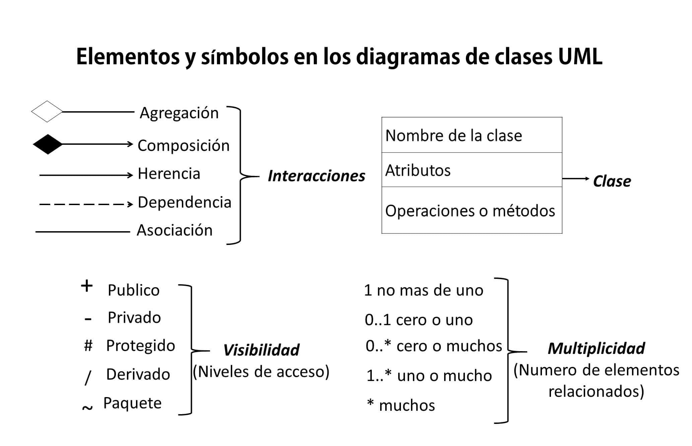

GENERAR FILES:

javadoc -d doc src/com/recuperacio/*.java

o

mvn javadoc:javadoc

DIAGRAMES DE CLASES:

És un tipus de diagrama que descriu l'estructura d’un sistema, mostrant les classes que el formen, els seus atributs, funcions/mètodes i les relacions entre els objectes.

