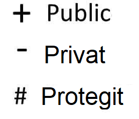

# TEST D'UNA FUNCIÓ SENZILLA

- Per fer una funció de test necesitarem primer de tot fer un import de JUnit per obtenir els recursos necessaris de la lliberia. La qual ens permet comprobar el resultats de la funció.

#### CONFIGURACIÓ

En cas de no tenir configurat el pom haurem d'afegir la dependencia del JUnit al pom del nostre projecte:

```xml
<dependency>
    <groupId>org.junit.jupiter</groupId>
    <artifactId>junit-jupiter</artifactId>
    <version>5.10.0</version>
    <scope>test</scope>
</dependency>
```

## EINES

- 
- AssertEquals -> Compara si el valor esperat és igual al valor actual.
- AssertFalse/AssertTrue -> retornarà true o false si la condició o es
- assertNotNull-> serveix per comprobar si un objecte no es null
- assertThrows -> Comprobem si es llença l'excepcio pertanyent.
- 

### EXEMPLE

Tenim aquesta clase Calculadora amb uns metodes senzills:

```java
// Calculadora.java
public class Calculadora {
    public int sumar(int a, int b) {
        return a + b;
    }
    public int restar(int a, int b) {
        return a - b;
    }
    public int multiplicar(int a, int b) {
        return a * b;
    }
    public int divisio(int a, int b) throws ArithmeticException {
        if (b == 0){
            throw new ArithmeticException("No es pot dividir entre 0.");
        }
        return a / b;
    }
}
```

Ara, per fer el test, aplicarem les eines explicades anteriorment:

```java
    import org.junit.jupiter.api.Test;
    import static org.junit.jupiter.api.Assertions.*;
    @Test
    public void testCalculadora() {
        Calculadora calc = new Calculadora();

        assertEquals(5, calc.suma(2, 3)); //comproben que el resultat de fer 2 + 3 sigui igual a 5
        assertEquals(0, calc.suma(2, -2));
        assertEquals(-5, calc.suma(-2, -3));

        assertEquals(1, calc.restar(4, 3));
        assertEquals(12, calc.multiplicar(4, 3));
        assertEquals(4, calc.divisio(12, 3));
        Exception exception = assertThrows(ArithmeticException.class,() ->  calc.divisio(2, 0)); //Fem un objecte tipus excepcio i cridem al metode assertThrows per obtenir l'excepció i el cas que la provoca
        assertEquals("No es pot dividir entre 0.", exception.getMessage()); //Comprobem que el missatge llençat es igual al que dona l'excepció.

        System.out.println("testCalculadora esta be");

    }


```

# GENERAR HTML amb documentació **JavaDoc**

La documentació JavaDoc permet generar pàgines .html automàticament a partir de comentaris dins el codi.

Per generar, podem fer-ho de diferents maneres:
**AMB COMANDA JAVADOC**

```bash
javadoc -d doc src/com/recuperacio/*.java
```

o
**AMB EL MAVEN**

```bash
mvn javadoc:javadoc
```

- Generarà a /target/reports/apidocs un index.html que conté totes les clases amb els comentaris.

## DIAGRAMES DE CLASES

- És un tipus de diagrama que descriu l'estructura d’un sistema, mostrant les classes que el formen, els seus atributs, funcions/mètodes i les relacions entre els objectes.
- Per representar una clase, hi dibuixem una cuadre on hi tindrà una capçalera amb el nom de l'objecte i a dins, els camps i metodes que ho formen
- ## EXEMPLE:

  Tenim la clase pelicula:

```java

  public class Pelicula {
      private String titol;
      private String director;
      private int anyEstrena;
      private int duradaMinuts;


      public Pelicula() {
          this.titol = "Desconeguda";
          this.director = "Anònim";
          this.anyEstrena = 0;
          this.duradaMinuts = 0;
      }

      public Pelicula(String titol, String director, int anyEstrena, int duradaMinuts) {
          this.titol = titol;
          this.director = director;
          this.anyEstrena = anyEstrena;
          this.duradaMinuts = duradaMinuts;
      }

      // Getters
      public String getTitol() {
          return titol;
      }

      public String getDirector() {
          return director;
      }

      public int getAnyEstrena() {
          return anyEstrena;
      }

      public int getDuradaMinuts() {
          return duradaMinuts;
      }

      // Setters
      public void setTitol(String titol) {
          this.titol = titol;
      }

      public void setDirector(String director) {
          this.director = director;
      }

      public void setAnyEstrena(int anyEstrena) {
          this.anyEstrena = anyEstrena;
      }

      public void setDuradaMinuts(int duradaMinuts) {
          this.duradaMinuts = duradaMinuts;
      }


      public void mostrarInformacio() {
          System.out.println("Títol: " + titol);
          System.out.println("Director: " + director);
          System.out.println("Any d'estrena: " + anyEstrena);
          System.out.println("Durada: " + duradaMinuts + " minuts");
      }


  }

```


### RELACIONS

- Es poden relacionar diferents objectes entre si:

---

| Tipus                  | Descripció breu                                                                  |
| ---------------------- | --------------------------------------------------------------------------------- |
| **Herència**    | Una classe hereta atributs i mètodes d’una altra.                               |
| **Composició**  | Una classe conté una altra, i no pot existir per separat.                        |
| **Agregació**   | Una classe conté una altra, però poden viure separades.                         |
| **Dependència** | La clase necessita d'una altra per funcionar, ja sigui com parametre o una crida. |
| **Associació**  | Una classe manté una referència a una altra.                                    |

---

REPRESENTACIO AL DIAGRAMA:


###### ESTRUCTURES DE CLASSES

- RELACIONS:
- Per representar la visibilitat dels camps, hi introduirem abans del nom un d'aquest simbols:
  

##### MULTIPLICITAT

| **Tipus**                   | **Descripció**                                                                                                                                               |
| --------------------------------- | ------------------------------------------------------------------------------------------------------------------------------------------------------------------- |
| **1 a molts (1 - \*)**      | Una classe es relaciona amb múltiples instàncies d'una altra classe. Per exemple, un autor pot tenir molts llibres.                                               |
| **Molts a molts (\* - \*)** | Diverses instàncies d'una classe poden estar relacionades amb diverses instàncies d'una altra. Per exemple, molts estudiants poden estar inscrits a molts cursos. |
| **1 a 1 (1 - 1)**           | Una instància d'una classe es relaciona amb exactament una instància d'una altra, i viceversa. Per exemple, cada persona té un únic DNI.                        |

## EXEMPLE

Aqui podem veure un diagrama senzill d'un cinema, on les relacions son associatives, ja que es fan referencia entre si com ara:

| **Classe**       | **Relació**                                                        | Tipus UML   | Multiplicitat                                                                                                                |
| ---------------------- | ------------------------------------------------------------------------- | ----------- | ---------------------------------------------------------------------------------------------------------------------------- |
| **Sala**         | Una sala pot tenir moltes sessions.                                       | Associació | 1 a molts amb sessió(1 sala pot tenir moltes sessions)                                                                      |
| **Sessió**      | Una sessió pertany a una única sala i projecta una única pel·lícula. | Associació | **Relació 1-1 amb Sala i 1-1 amb Pel·lícula** (cada sala te una sessió i cada sessió nomes projecta una pelicula) |
| **Pel·lícula** | Una pel·lícula pot aparèixer en moltes sessions diferents.             | Associació | Relació 1 a molts amb Sessió( 1 pelicula pot apareixer a moltes sessions)                                                  |

## DIAGRAMA D'EXEMPLE


